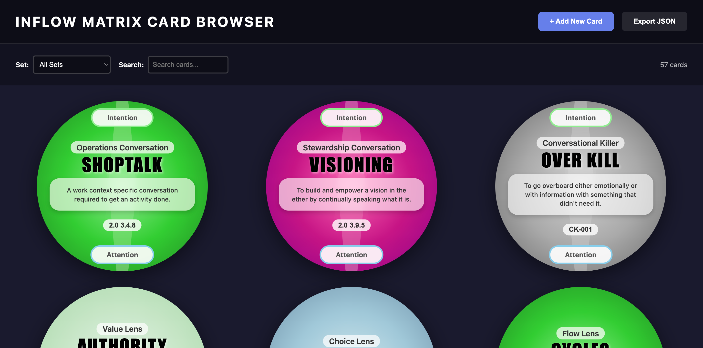

# Inflow Matrix Card Renderer

A browser-based tool for creating and cataloging the card sets from Elijah Ignatieff's Inflow Matrix gameworld. This renderer generates beautiful circular cards entirely from data - no images required.



## About

The Inflow Matrix is a comprehensive system of tools for navigating human consciousness, communication, and collaboration. Created by **Elijah Ignatieff** as part of the **School of Conscious Communication**, it includes multiple card sets that map different dimensions of human interaction and awareness.

This card renderer is part of the ongoing work to digitize and preserve Elijah's legacy, making these transformative tools accessible to planetary guardians, edgeworkers, and cultural creatives worldwide.

## The Card Sets

The Inflow Matrix includes **~371 cards** across six major sets:

### 1. Conversation Cards (73 cards)
Cards for navigating conscious conversation. Features **Intention/Attention poles** and light beam effects.

**Color coding by conversation type:**
- 🟢 Green - Operations Conversation (3.4)
- 🩷 Pink - Synergy Conversation (3.6)
- 🟣 Purple - Research Conversation (3.1)
- 🔵 Light Blue - Learning Conversation (3.3)
- 💙 Neon Blue - Infrastructure Conversation (3.2)
- 🟠 Orange - Services Conversation (3.7)
- 🟡 Yellow - Creativity Conversation (3.5)
- 🔴 Red - Marketing Conversation (3.8)
- 💗 Dark Pink - Stewardship Conversation (3.9)
- ⚫ Gray - Conversational Killers

### 2. Value Lens Cards (115 cards)
Exploring values and their role in human systems. All cards share a **pale metallic green** background. No card IDs displayed.

### 3. Choice Lens Cards (91 cards)
Mapping the territory of choice and decision-making. All cards use **metallic blue** backgrounds. No card IDs displayed.

### 4. Flow Lens Cards (varied colors)
Understanding flow states and rhythms. Cards feature **enneagram symbols** in the center and varied color backgrounds corresponding to their position in the system.

### 5. Harmony Lens Cards (30 cards)
Community perspectives and harmonious relating. Features **enneagram center symbols** with varied colors.

### 6. Synergy Lens Cards (31 cards)
Organizational functions and synergistic relationships. Features **enneagram center symbols** with varied colors.

## Features

✅ **Pure browser rendering** - No image files needed, cards generated from data
✅ **Circular card design** - Matches Elijah's original aesthetic
✅ **Radial gradients** - 13 different color schemes
✅ **Intention/Attention poles** - For conversation cards only
✅ **Light beam effects** - Subtle atmospheric touches
✅ **Interactive form** - Add cards easily with live preview
✅ **JSON export** - Download your card database
✅ **Responsive design** - Works on any screen size

## How It Works

The renderer creates cards from simple data objects:

```json
{
  "id": "2.0 3.4.8",
  "title": "SHOPTALK",
  "description": "A work context specific conversation required to get an activity done.",
  "set": "Conversation",
  "type": "Operations Conversation",
  "color": "green"
}
```

The browser transforms this into a beautiful circular card with proper styling, colors, and layout - all calculated and rendered in real-time.

## Usage

### View Online
**[Live Demo](https://school-of-conscious-communication.github.io/card-renderer/)** (coming soon)

### Run Locally
1. Clone this repository:
   ```bash
   git clone https://github.com/School-of-Conscious-Communication/card-renderer.git
   cd card-renderer
   ```

2. Open `index.html` in your browser:
   ```bash
   # macOS
   open index.html
   
   # Linux
   xdg-open index.html
   
   # Windows
   start index.html
   ```

3. Or serve with a local server:
   ```bash
   python -m http.server 8000
   # Visit http://localhost:8000
   ```

### Creating Cards

1. Fill out the form with card details
2. Select the appropriate set and color
3. Click "Add Card to Collection"
4. See your card rendered instantly
5. Export all cards as JSON when done

## The Journey So Far

### Phase 1: Understanding the System ✅
- Studied Elijah's physical card prototypes
- Identified 6 major card sets
- Discovered color coding patterns
- Cataloged ~371 total cards

### Phase 2: Building the Renderer ✅
- Created pure browser-based card generator
- Implemented all color gradients
- Added conversation card features (poles, beams)
- Built interactive form for card creation
- Added JSON export functionality

### Phase 3: Cataloging (In Progress)
- Creating sample set of 10 cards
- Testing renderer with real card data
- Refining visual details and typography

### Phase 4: AI-Assisted Cataloging (Next)
- Build image scanner to extract card data
- Process existing card images in bulk
- Human verification and correction
- Complete database of all 371 cards

### Phase 5: Card Browser & Tools (Future)
- Interactive card browser/viewer
- Search and filter capabilities
- Card relationship mapping
- Integration with other Inflow Matrix tools

## Project Structure

```
card-renderer/
├── index.html          # Main application (self-contained)
├── README.md           # This file
├── LICENSE             # MIT License
└── docs/
    └── preview.png     # Screenshot for documentation
```

## Technology

- **Pure HTML/CSS/JavaScript** - No build process required
- **SVG graphics** - For circular designs and effects
- **Responsive design** - Mobile and desktop friendly
- **No dependencies** - Runs anywhere a browser runs

## Contributing

We welcome contributions from the community! Here's how you can help:

1. **Add card data** - Help catalog the remaining cards
2. **Improve rendering** - Enhance visual accuracy
3. **Build features** - Card browser, search, filters
4. **Documentation** - Explain the card system
5. **Testing** - Try it, break it, report issues

To contribute:
1. Fork the repository
2. Create a feature branch
3. Make your changes
4. Submit a pull request

## The Bigger Picture

This card renderer is one tool in the larger ecosystem of the School of Conscious Communication:

- 🌀 **[Time Translator](https://github.com/School-of-Conscious-Communication/time-translator)** - Navigate dimensions of time
- 🎴 **Card Renderer** (this project) - Digitize the card sets
- 🗺️ **Synergy Map** (planned) - Map collaborative dynamics
- 🧭 **Inflow Matrix** (planned) - Complete gameworld integration

## Attribution

**Original Creator**: Elijah Ignatieff (1979-2023)  
**Product Development**: Jorge Pedret (in collaboration with Claude AI)
**Organization**: School of Conscious Communication  
**Website**: [school-of-conscious-communication.github.io](https://school-of-conscious-communication.github.io/)  
**YouTube**: [@schoolofconsciouscommunica2761](https://www.youtube.com/@schoolofconsciouscommunica2761/featured)

Elijah took a stand for radically sharing his work. These tools are offered freely to support humanity's evolution in consciousness and communication.

## License

MIT License - See [LICENSE](LICENSE) file for details.

This tool is offered in the spirit of Elijah's radical sharing philosophy. Use it, modify it, share it. Attribution to Elijah Ignatieff and the School of Conscious Communication is appreciated.

## Contact & Community

- **GitHub Organization**: [School-of-Conscious-Communication](https://github.com/School-of-Conscious-Communication)
- **Main Website**: [school-of-conscious-communication.github.io](https://school-of-conscious-communication.github.io/)
- **Issues & Discussions**: Use this repository's [Issues](../../issues) page

---

*"These tools have the power to change the course of humanity."*

Built with 💜 by Jorge Pedret, the community, in honor of Elijah's vision for a better future for humanity and planet Earth.