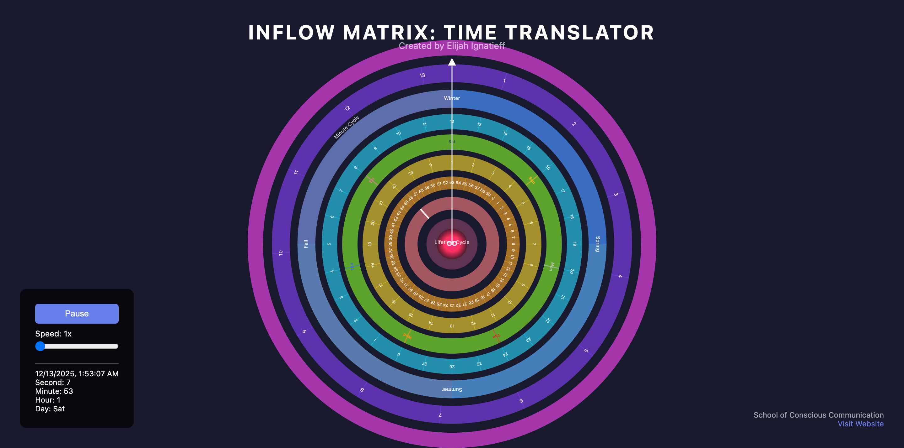

# Time Translator

A living calendar with 9 concentric wheels that navigate different dimensions of time—from timelessness to the present moment, through daily, weekly, monthly, seasonal, and yearly cycles.



## About

The Time Translator is part of the **Inflow Matrix** Gameworld created by **Elijah Ignatieff** as a tool for the **School of Conscious Communication**.

This tool helps navigate multiple dimensions of time simultaneously, revealing patterns and synchronicities across different temporal cycles. 

It's designed for timekeepers, contemplatives, and those seeking to understand their place in the fabric of time.

### Features

- **9 Concentric Cycles**: Timelessness, Present Moment, Minute (60s), Hour (60m), Day (24h), Week (7d), Month (28d), Season (4), Year (13 months)
- **Real-time Movement**: Wheels rotate with actual time, like a living clock
- **Planetary Colors**: Each day of the week displays its planetary correspondence
- **Seasonal Backgrounds**: Visual distinction for Spring, Summer, Fall, Winter
- **Speed Control**: Adjust time flow to observe patterns at different scales
- **Clean Interface**: Contemplative design for temples of time

## Live Demo

**[View Live Demo](https://school-of-conscious-communication.github.io/time-translator/)**

## Installation & Usage

### Option 1: View Online
Simply visit the [live demo](https://school-of-conscious-communication.github.io/time-translator/) to use the Time Translator in your browser.

### Option 2: Run Locally
1. Clone this repository:
   ```bash
   git clone https://github.com/School-of-Conscious-Communication/time-translator.git
   cd time-translator
   ```

2. Open `index.html` in your web browser:
   ```bash
   # On macOS
   open index.html
   
   # On Linux
   xdg-open index.html
   
   # On Windows
   start index.html
   ```

3. Or serve it locally with any web server:
   ```bash
   # Using Python 3
   python -m http.server 8000
   
   # Using Node.js http-server
   npx http-server
   ```

### Option 3: Deploy Your Own Instance

#### GitHub Pages
1. Fork this repository
2. Go to Settings → Pages
3. Select "Deploy from a branch"
4. Choose `main` branch and `/root` folder
5. Your instance will be available at `https://[your-username].github.io/time-translator/`

#### Netlify
1. Fork this repository
2. Connect your GitHub account to Netlify
3. Select the repository
4. Deploy (no build command needed)

#### Vercel
1. Fork this repository
2. Import project to Vercel
3. Deploy (auto-detected as static site)

## Technology

Built with:
- React (via CDN)
- SVG for wheel rendering
- Pure JavaScript/CSS
- No build process required

## Roadmap

Future enhancements planned:
- [ ] Moon phase visualization
- [ ] Birth date customization for Lifetime cycle
- [ ] Mayan calendar integration
- [ ] Astrological correspondences
- [ ] Manual wheel rotation (time travel)
- [ ] Pattern recognition features
- [ ] Date marking and annotations
- [ ] Export/share specific moments

## Contributing

We welcome contributions from planetary guardians, edgeworkers, and cultural creatives! 

To contribute:
1. Fork the repository
2. Create a feature branch (`git checkout -b feature/amazing-feature`)
3. Commit your changes (`git commit -m 'Add amazing feature'`)
4. Push to the branch (`git push origin feature/amazing-feature`)
5. Open a Pull Request

Please ensure your code maintains the contemplative, accessible spirit of the original work.

## Attribution

**Original Creator**: Elijah Ignatieff (1979-2023)
**Digital Version**: Jorge Pedret (in collaboration with Claude AI)
**Organization**: School of Conscious Communication  
**Website**: [school-of-conscious-communication.github.io](https://school-of-conscious-communication.github.io/)  
**YouTube**: [@schoolofconsciouscommunica2761](https://www.youtube.com/@schoolofconsciouscommunica2761/featured)

Elijah took a stand for radically sharing his work, believing these tools should be freely available to support humanity's evolution in consciousness and communication.

## License

MIT License - See [LICENSE](LICENSE) file for details.

This tool is offered freely in the spirit of Elijah's radical sharing philosophy. Use it, modify it, share it, deploy your own instance. Attribution to Elijah Ignatieff and the School of Conscious Communication is required.

## Community

- **GitHub Organization**: [School-of-Conscious-Communication](https://github.com/School-of-Conscious-Communication)
- **Main Website**: [school-of-conscious-communication.github.io](https://school-of-conscious-communication.github.io/)
- **Contact**: Open an issue in this repository or reach out through the main website

## Support the Work

This is free, open-source work. If these tools serve you, consider:
- Sharing them with others who might benefit
- Contributing code improvements
- Documenting your experiences using the tools
- Supporting the School of Conscious Communication's mission

---

*"The Time Translator is a living art piece for time keepers. It is displayed in temples of contemplation, record keeping and planning."*